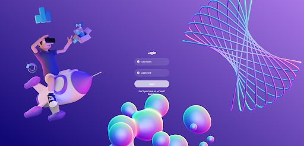
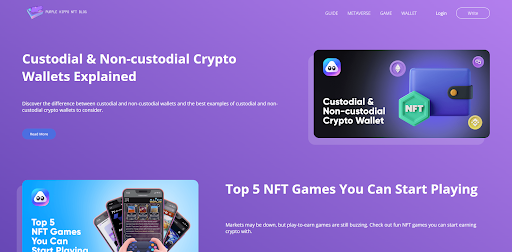
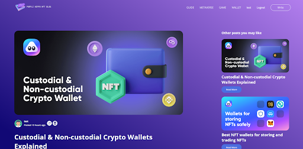
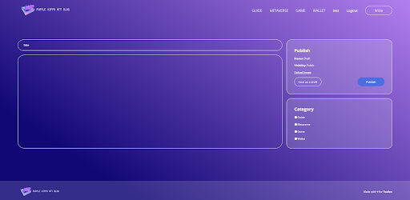

# NFT Блог
## Проект выполнили:
- Блохина Анастасия
- Загайнова Кристина

## Описание:
Наш проект - это блог об NFT, объединяющий людей, интересующихся темой криптографических токенов. Для наполнения сайта использовались посты сайта: https://www.airnfts.com/blog

## В проекте реализованы:
- Регистрация и авторизация   
- Просмотр всех постов и их сортировка по категориям   
- Просмотр отдельного поста, возможность его изменять (если текущий пользователь является автором поста)   
- Публикация поста для авторизованных пользователей   
- Хранение пользователей и постов в БД (пароли пользователей хранятся в захешированном виде)

## Используемые технологии: 
- JavaScript
- React
- Node.js
- MySQL
- HTML/SCSS

